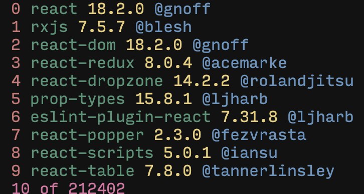

<h1 align="center">niq</h1>

<p align="center">Query npm packages</p>


## Usage
```sh
npm i -g zx # must
npm i -g ni # recommendedm or change the 22 line in index into `npm install`
```
```sh
zx index.mjs react # query about react
```

```sh
zx index.mjs react --i # with install panel
```
## License
[MIT](./LICENSE) License © 2022 [Cheng-DX](https://github.com/Cheng-DX)
